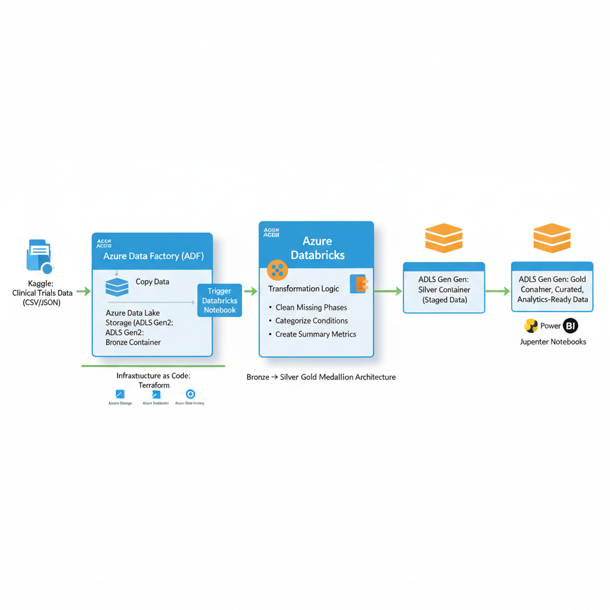
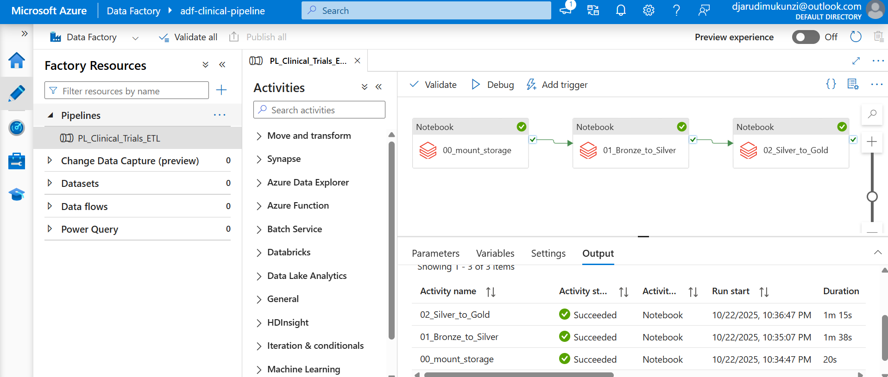
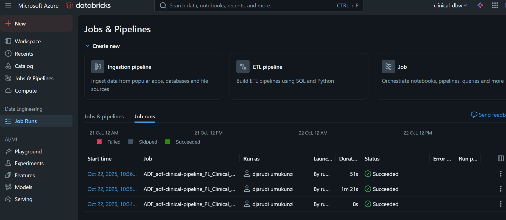
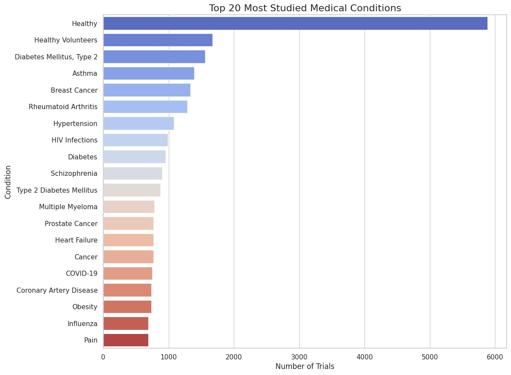
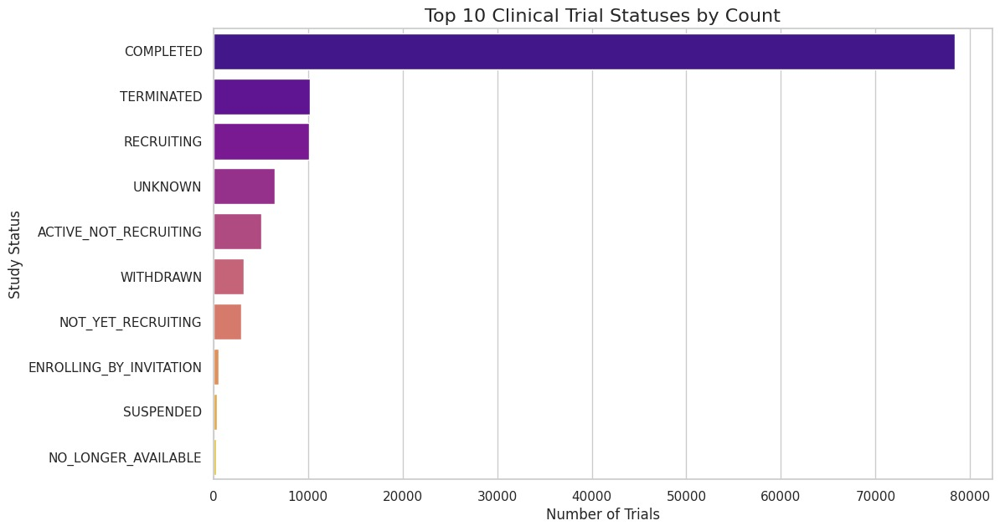
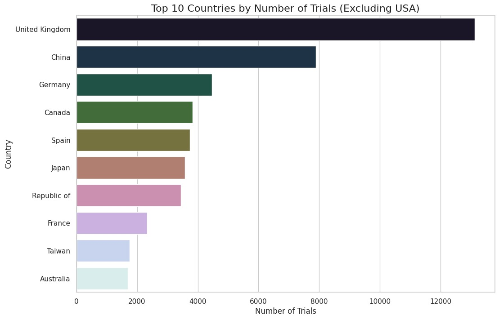

# 🧬 Clinical Trials Data Engineering Pipeline for Analytics and Research Insights

This project demonstrates a complete, end-to-end **data engineering pipeline** built on **Microsoft Azure**.  
The pipeline ingests raw clinical trial data, processes it through a **Medallion Architecture** using **Azure Databricks**, and orchestrates the workflow with **Azure Data Factory**.

---

## 🏗️ Project Architecture

The infrastructure is deployed using **Terraform** and follows a **modern data platform design**.

(./images/images\project_architecture.png)

### 🔹 Core Components

- **Infrastructure as Code:** Terraform for automated deployment of all Azure resources.  
- **Storage:** Azure Data Lake Storage (ADLS) Gen2, organized into **Bronze**, **Silver**, and **Gold** containers.  
- **Transformation:** Azure Databricks for scalable data cleaning, transformation, and aggregation using **Spark (PySpark and SQL)**.  
- **Orchestration:** Azure Data Factory (ADF) to schedule and run the Databricks notebooks in the correct sequence.  

---

## 💎 Data Flow: The Medallion Architecture

The pipeline processes data in three distinct stages:

### 🥉 1. Bronze Layer

- **Source:** Raw, unmodified `clinical_trials.csv` (519 MB) ingested from the source (e.g., Kaggle) into `/mnt/bronze`.  
- **Format:** CSV  

---

### 🥈 2. Silver Layer

- **Transformation Notebook:** `01_Bronze_to_Silver`  
- **Actions:**  
  - Reads the raw CSV  
  - Cleans all column names (e.g., `NCT Number` → `nct_number`) for compatibility with Parquet/Delta  
  - Saves cleaned data in **Delta Lake** format  

- **Result:**  
  Clean, schema-enforced, and query-performant table at:  

/mnt/silver/clinical_trials

---

### 🥇 3. Gold Layer

- **Transformation Notebook:** `02_Silver_to_Gold`  
- **Actions:**  
- Reads the clean Silver data  
- Performs business-level aggregations and feature engineering (e.g., standardizing phases, exploding conditions, extracting country)  
- Saves multiple, smaller, analytics-ready tables  

- **Result:**  
Aggregated, business-ready tables at:  

/mnt/gold/

Example tables:  
- `trials_by_status`  
- `top_20_conditions`

---

## ⚙️ Pipeline Orchestration & Execution

The entire ETL process is **automated and orchestrated** by a single **Azure Data Factory pipeline**, which runs the three Databricks notebooks in sequence.

### ✅ ADF Pipeline Success

### ✅ Databricks Job Run

---

## 📊 Final Analytics & Insights (Gold Layer Visualizations)

The final Gold tables are used to generate analytics directly within the Databricks notebook.  
These visualizations confirm that the data is clean and provide immediate insights.

### 🔝 Top 20 Most Studied Medical Conditions

### 📈 Top 10 Clinical Trial Statuses

### 🌍 Top 10 Countries by Number of Trials (Excluding USA)

---

## 📦 Project Deliverables

### 🧩 Terraform Files
- `main.tf`  
- `variables.tf`  
- `providers.tf`  
> Used for deploying all Azure resources automatically.

### 🪶 Databricks Notebooks
- `00_mount_storage.py` – Securely mounts ADLS containers to DBFS  
- `01_Bronze_to_Silver.py` – Cleans and converts raw CSV data to a Silver Delta table  
- `02_Silver_to_Gold.py` – Transforms Silver data into aggregated Gold tables and generates visualizations  

### 🧠 Azure Data Factory
- **Pipeline:** `PL_Clinical_Trials_ETL` (JSON)  
> Orchestrates and automates the execution of the Databricks notebooks.

---

## 💰 Resource Cleanup

> ⚠️ **Note:**  
> All Azure resources used for this project have been **deleted** after successful validation to prevent unnecessary **credit consumption and cost detection**.  
> The Terraform destroy command (`terraform destroy`) was executed to safely tear down all deployed resources.

---

## 🧾 Summary

This project demonstrates how to build a **scalable, automated data pipeline** for clinical trial analytics using the **Azure ecosystem**, leveraging:  
Terraform 🚀 + ADLS Gen2 📦 + Databricks 🔥 + ADF 🪄 + Delta Lake ⚡

---

